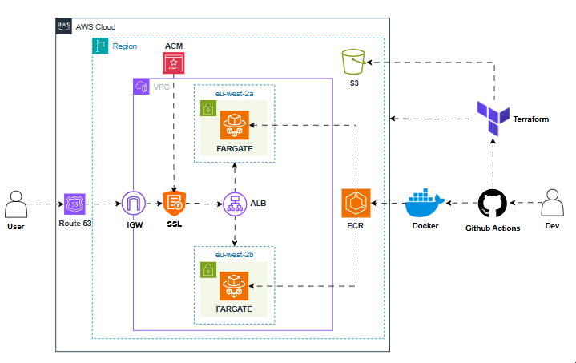

# 🚀 AWS Threat Composer Deployment via ECS & Terraform

## Project Overview
This project deploys the Amazon **Threat Composer Tool**, an open-source application for threat modeling and security assessment, onto **AWS ECS (Fargate)** using **Terraform**. The deployment is designed to be fully automated, leveraging modular Terraform code to provision all necessary infrastructure components. Infrastructure changes and application deployments are managed through **GitHub Actions CI/CD pipelines**, ensuring consistency, repeatability, and minimal manual intervention.

The solution provisions a secure and scalable cloud environment, including **VPC networking**, an **Application Load Balancer** with **HTTPS via ACM**, **Route 53** DNS records, and a container image hosted in **Amazon ECR**. With a single workflow, the application can be built, scanned for vulnerabilities, deployed, and made accessible via a custom domain over HTTPS — delivering a ready-to-use threat modeling platform in minutes.
## 🏗️ Architecture Diagram:

<p align="center">
  
</p>


## 📁 Project Structure
```
└── ECS-THREAT-COMPOSER
    ├── pre-commit-config.yaml
    ├── app/
    ├── terraform/
    │    ├── backend.tf
    │    ├── main.tf
    │    ├── provider.tf
    │    ├── variables.tf
    │    ├── terraform.tfvars
    │    └── modules/
    │        ├── acm/
    │        ├── alb/
    │        ├── ecs/
    │        ├── route53/
    │        └── vpc/
    └── .github/workflows/
           ├── docker-build-push.yaml
           ├── terraform-apply.yaml
           ├── terraform-destroy.yaml
           └── terraform-plan.yaml
```

## ✨ Key Features
#### 📊 Threat Composer Application
- **Amazon Threat Composer**: Deploys the open-source threat modeling tool in a containerised environment
- **Browser-Based Access**: Accessible via HTTPS with a custom Route 53 domain
- **Dockerised Deployment**: Application container built, pushed, and run on ECS Fargate
- **Ready-to-Use Setup**: No manual installation — app is live after pipeline execution

#### 🚀 Infrastructure Automation
- **Terraform Modules**: Modular design for VPC, ECS, ALB, Route 53, and ACM
- **GitHub Actions Pipelines**: Automated workflows for Docker build/push, Terraform plan/apply/destroy
- **ECR Integration**: Docker images built and pushed directly into Amazon ECR
- **Scalable ECS Fargate**: Serverless compute with task definition and service management
- **Automated DNS & SSL**: Route 53 records and ACM certificates provisioned automatically

#### 🔐 Security & Compliance
- **ACM-Managed TLS**: Encrypted HTTPS connections via Application Load Balancer
- **Network Isolation**: Security groups restrict access to only necessary traffic (ALB ↔ ECS)
- **IAM Roles & Policies**: Fine grained AWS permissions for ECS tasks and pipelines
- **Pre-Commit Hooks**: Enforces linting and formatting before committing changes
- **Checkov Integration**: Infrastructure code scanning for misconfigurations

#### 📈 Monitoring & Reliability

- **ALB Health Checks**: Continuous monitoring of ECS task health via load balancer
- **ECS Service Insights**: Built in metrics for CPU, memory, and scaling behavior
- **Centralised Logging**: ECS, ALB, and VPC logs available in CloudWatch
- **High Availability**: Multi-AZ deployment with load-balanced traffic distribution
#
## ⚙️ How It Works
### 1️⃣ Build & Push Docker Image
The application container is built from the `app/` directory and managed via a GitHub Actions workflow (`docker-build-push.yaml`). When triggered manually, it:
- Authenticates to Amazon ECR using **GitHub secrets**.
- **Builds & tags** the Docker image (`ecs-threat-app:latest`).
- **Scans vulnerabilities** with Trivy (CRITICAL/HIGH severities).
- Publishes results to GitHub’s **Security** tab.
- **Pushes** the image to Amazon ECR for ECS deployment.
```yaml
- name: Build the image
  run: |
    docker build -t ecs-threat-app ./app
    docker tag ecs-threat-app:latest ${{ secrets.AWS_REPOSITORY }}/ecs-threat-app:latest

- name: Run Trivy vulnerability scanner
  uses: aquasecurity/trivy-action@0.28.0
```
### 2️⃣ Provision Infrastructure with Terraform
All infrastructure is defined under the `terraform/` directory, with each core AWS service organised into its own **module** (`vpc/`, `alb/`, `ecs/`, `acm/`, `route53/`). This modular approach makes the code easy to extend, test, and maintain.

- **VPC Module →** Creates a dedicated VPC with subnets, route tables, and an internet gateway to securely host the application
- **ALB Module →** Provisions an Application Load Balancer with HTTPS termination using ACM. Traffic is routed only to healthy ECS tasks
- **ECS Module →** Deploys the containerised Threat Composer application to Fargate, pulling the latest image from ECR and scaling on demand
- **Route 53 Module →** Configures DNS to make the app available at a custom domain, routed securely through the ALB

```yaml
module "ecs" {
  source                      = "./modules/ecs"
  ecs_container_name          = var.ecs_container_name
  vpc_id                      = module.vpc.vpc_id
  ecs_service_desired_count   = var.ecs_service_desired_count
  ecs_ingress_sg_ids          = [module.alb.lb_sg_id]
  ...
}
```

With a single `terraform apply`, the complete infrastructure — networking, security, compute, and DNS — is provisioned automatically, delivering a **secure and production-ready ECS environment**.

### 3️⃣ Terraform Plan & Security Scanning
Before any infrastructure changes are applied, the **Terraform Plan workflow** provides a controlled and secure validation step. This ensures infrastructure changes are safe, compliant, and free from misconfigurations before deployment.

- **Terraform Plan →** Runs `terraform init` and `terraform plan` to preview changes without applying them.
- **Linting (TFLint) →** Catches syntax errors, unused variables, and configuration issues early.
- **Policy Scanning (Checkov)** → Enforces security best practices (e.g., encrypted storage, least-privilege IAM roles, network restrictions).
- **SARIF Reports →** Both TFLint and Checkov results are uploaded to GitHub’s Security tab for visibility and auditing.

```yaml
- name: Run TFLint
  run: |
    tflint --init
    tflint --format sarif > tflint.sarif

- name: Run Checkov
  uses: bridgecrewio/checkov-action@v12
```

> 📌 **Key benefit:** Every infrastructure change is previewed, linted, and scanned for compliance before it ever reaches AWS, reducing security risks and catching issues early in the pipeline.
